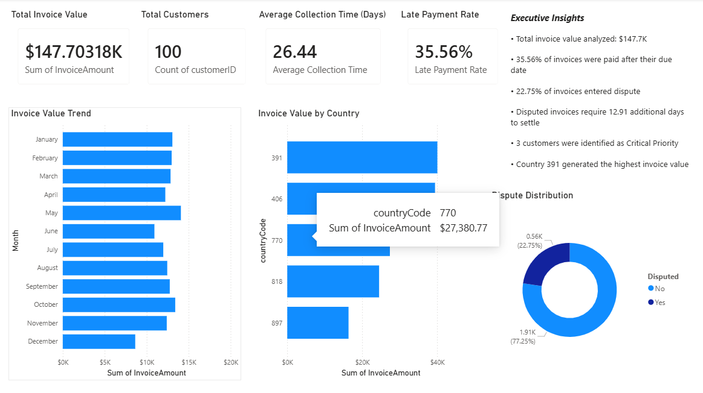
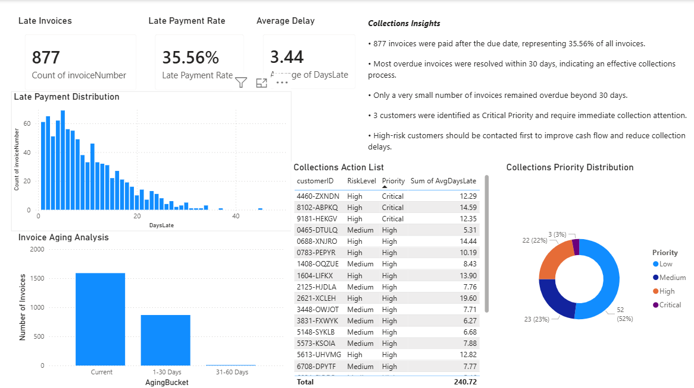
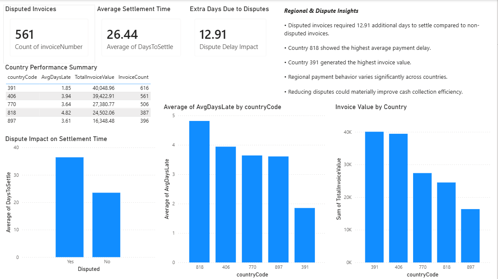

# Accounts Receivable Intelligence Dashboard

## Project Overview

Organizations often struggle with delayed payments, invoice disputes, customer payment risk, and inefficient collections prioritization.

This project analyzes Accounts Receivable data to identify payment delays, customer risk patterns, dispute impact, invoice aging trends, and regional performance metrics.

The solution combines Python-based data analysis with Power BI dashboards to provide actionable business insights.

---

## Tools & Technologies

- Python
- Pandas
- NumPy
- Power BI
- Git
- GitHub

## Data Source

- Accounts Receivable Dataset from Kaggle

---

## Project Features

- Executive KPI Dashboard
- Customer Risk Scoring
- Customer Health Analysis
- Collections Prioritization
- Invoice Aging Analysis
- Dispute Impact Analysis
- Regional Performance Analysis

---

## Key Business Insights

### Dispute Impact

Disputed invoices required:

36.42 - 23.51 = 12.91 additional days

to settle compared to non-disputed invoices.

### Late Payments

877 invoices were paid after the due date.

Late payment rate:

35.56%

### Customer Risk

- 11 customers classified as High Risk
- 3 customers classified as Critical Priority

### Invoice Aging

64.4% of invoices were current.

35.2% of invoices were overdue by up to 30 days.

Very few invoices remained overdue beyond 30 days.

### Regional Performance

Country 818 showed the highest average payment delay.

Country 391 generated the highest invoice value.

---

# Dashboard Pages

## Executive Dashboard

---

## Customer Risk Intelligence

---

## Collections & Aging Dashboard

---

## Dispute & Regional Analysis

---

# Project Structure

Accounts-Receivable-Analytics
│
├── data
├── src
├── reports
├── screenshots
├── dashboard
└── README.md

---

# Business Value

This solution helps finance teams:

- Identify high-risk customers
- Prioritize collections efforts
- Monitor invoice aging
- Quantify dispute impact
- Improve cash flow visibility
- Analyze regional payment performance
